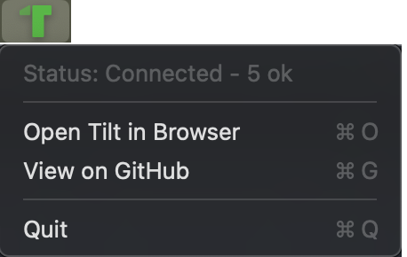
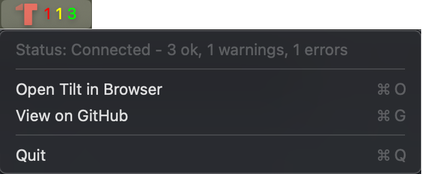

# TiltBar

A macOS menu bar app that shows your [Tilt](https://tilt.dev) resource status at a glance.

## What it looks like

**All resources healthy:**



**Resources with warnings and errors:**



## Features

- 🟢 **Dynamic Tilt logo** - Green when all good, gray when building, red on errors
- 📊 **Real-time updates** - No polling, streams directly from Tilt
- 🎯 **Clean display** - Just the logo when everything is green
- 🔄 **Auto-reconnect** - Handles Tilt restarts automatically
- 🚫 **Menu bar only** - No dock icon

## Installation

### Homebrew (Recommended)

```bash
brew install seriousben/tiltbar/tiltbar
```

**Launch the app:**

To make it visible in Spotlight/Alfred/Launchpad, copy it to Applications:
```bash
cp -r /opt/homebrew/opt/tiltbar/TiltBar.app ~/Applications/
```

Or launch it directly:
```bash
open /opt/homebrew/opt/tiltbar/TiltBar.app
```

> **Note:** The copy-to-Applications step is temporary while we prepare a Homebrew cask.

### From Source

**Requirements:**
- macOS 13.0+
- Xcode Command Line Tools: `xcode-select --install`

```bash
# Clone the repository
git clone https://github.com/seriousben/tilt-status-bar.git
cd tilt-status-bar

# Build and run
make run
```

That's it! The Tilt logo will appear in your menu bar.

## Requirements

- macOS 13.0+
- [Tilt CLI](https://docs.tilt.dev/install.html) installed and running

## Usage

**Status Display:**
- 🟢 Green logo only = All resources healthy
- Icon + colored numbers = Issues present (e.g., "🔴1 🟡1 ⚪️2 🟢3")

**Menu:**
- Open Tilt in Browser
- Reconnect Now
- Quit

## Troubleshooting

**"Tilt CLI not found"**
- Run `which tilt` to verify Tilt is installed
- Install: https://docs.tilt.dev/install.html

**"Cannot connect"**
- Ensure Tilt is running: `tilt up`
- Test CLI: `tilt get uiresource`

## Development

See `Makefile` for all available commands. Key files:
- `main.swift` - App entry point
- `AppDelegate.swift` - Menu bar UI
- `TiltClient.swift` - Streams from `tilt get uiresource -w`
- `Models.swift` - Data structures

**Updating icons:**
- Icons are bundled with the app
- To update from a running Tilt instance: `make setup`

Code includes detailed comments explaining implementation.

## Contributing

This project uses [Conventional Commits](https://www.conventionalcommits.org/) and [Release Please](https://github.com/googleapis/release-please) for automated versioning and releases.

**Commit message format:**
- `feat:` - New features (triggers minor version bump)
- `fix:` - Bug fixes (triggers patch version bump)
- `docs:` - Documentation changes
- `chore:` - Maintenance tasks

**Example:**
```bash
git commit -m "feat: add keyboard shortcut to toggle menu"
```

Releases are created automatically when PRs are merged to `main`.

## License

Apache 2.0
